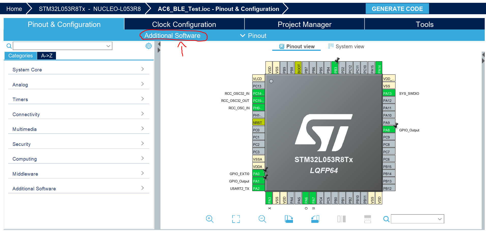

# BlueNRG_Scanner

This is a BLE scanner example for the ST BluenrgMS, it shows the device and the RSSI. This code works with the NucleoL053 and the X-Nucleo-IDB05A1 expansion board.

)


## Prerequisites

*  Download STM32CubeMX
*  Download X-CUBE-BLE1 (This example uses the 4.3.0 version, sometimes the 4.4.0 doesn't work)
*  Download either KEIL or OpenSTM32. DO NOT USE IAR or CUBEIDE (IAR and STM32cubeIDE can cause problems.)

### Getting Started

### The easy way

Download the .Zip file or clone this repo to your computer, click on .cproject (you need to have [STM32 System Workbench](https://www.st.com/en/development-tools/sw4stm32.html) installed) and Voilà.

### The hard way (by yourself)

Open CubeMX, create a new project for the NUCLEO-L053 and configure the pinnouts as follow:
```
BLE_SCK   - SPI1_SCK    - PB3
BLE_MISO  - SPI1_MISO   - PA6
BLE_MOSI  - SPI1_MOSI   - PA7
BLE_IRQ   - GPIO_EXTI0  - PA0
BLE_CS    - GPIO_Output - PA1
BLE_Reset - GPIO_Output - PA8
            USART2_TX   - PA2
            USART2_RX   - PA3
```
Go to additional software and on the STMicroelectronics.X-CUBE-BLE1 select the Wireless_BlueNRG-MS list and put the following options.
```
Controller          -   Selected
HCI_TL              -   Basic
HCI_TL_INTERFACE    -   UserBoard
Utils               -   Selected
```



### Code

#### Pre-work

First of all add the following code...

On main.h
```
/* Includes ------------------------------------------------------------------*/
#include "stm32l0xx_hal.h"
#include "hci_tl_interface.h"
#include "stm32l0xx_it.h"
```

On hci_tl_interface.h add this, on the Exported Defines comment
```
extern EXTI_HandleTypeDef hexti0;
#define H_EXTI_0 hexti0
```
#### printf Prototype

On main.c add these lines after the #includes
```
#ifdef __GNUC__
  /* With GCC, small printf (option LD Linker->Libraries->Small printf
     set to 'Yes') calls __io_putchar() */
  #define PUTCHAR_PROTOTYPE int __io_putchar(int ch)
#else
  #define PUTCHAR_PROTOTYPE int fputc(int ch, FILE *f)
#endif /* __GNUC__ */
```

Between /* USER CODE 4 BEGIN */ & /* USER CODE 4 END */ add
```
PUTCHAR_PROTOTYPE
{
  /* Place your implementation of fputc here */
  /* e.g. write a character to the EVAL_COM1 and Loop until the end of transmission */
  HAL_UART_Transmit(&huart2, (uint8_t *)&ch, 1, 0xFFFF);

  return ch;
}
```

#### BLE app

Replace all the code on the generated app_x-cube-ble1.c to the one on this repo.

And you're done...

